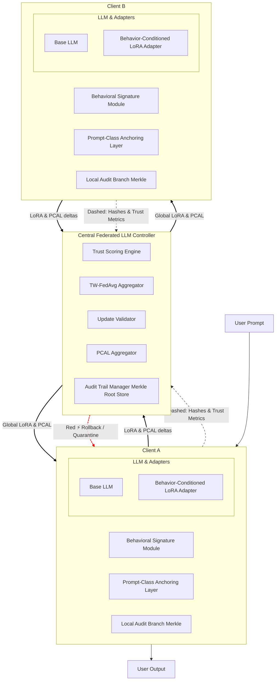

# Architecture Overview

This architecture implements a federated, behavior-conditioned secure login and transaction system. Below is a detailed description of each component and the data flow, followed by the Mermaid diagram.

---

## Component Descriptions

**Central_Server (Central Federated LLM Controller):**
- **Trust Scoring Engine (TS):** Evaluates the trustworthiness of client updates.
- **TW-FedAvg Aggregator (TW):** Aggregates LoRA and PCAL deltas from clients using federated averaging.
- **Update Validator (UV):** Validates incoming model updates for integrity and compliance.
- **PCAL Aggregator (PA):** Aggregates Prompt-Class Anchoring Layer updates.
- **Audit Trail Manager (AR):** Maintains a Merkle root store for auditability and rollback.

**Client_A / Client_B:**
- **Base LLM (BA1/BA2):** The foundational language model on each client.
- **Behavior-Conditioned LoRA Adapter (LA1/LA2):** Personalizes the LLM based on user behavioral signatures.
- **Behavioral Signature Module (BS1/BS2):** Captures and encodes user-specific behavioral biometrics (e.g., typing rhythm, facial hash).
- **Prompt-Class Anchoring Layer (PCAL1/PCAL2):** Anchors prompt classes for robust adaptation.
- **Local Audit Branch (AU1/AU2):** Maintains a local Merkle branch for transaction integrity.

**Data Flow:**
- Clients send LoRA & PCAL deltas (solid arrows) to the central server for aggregation.
- Clients also send hashes & trust metrics (dashed arrows) for validation.
- The central server distributes global LoRA & PCAL updates back to clients.
- Rollback/quarantine (red arrow) is triggered if a client’s update is invalid or malicious.

**User Interaction:**
- Users interact with the client, submitting prompts and receiving outputs.

---

## Flowchart

